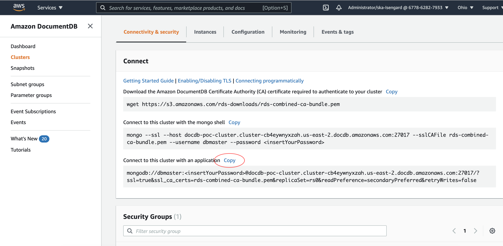
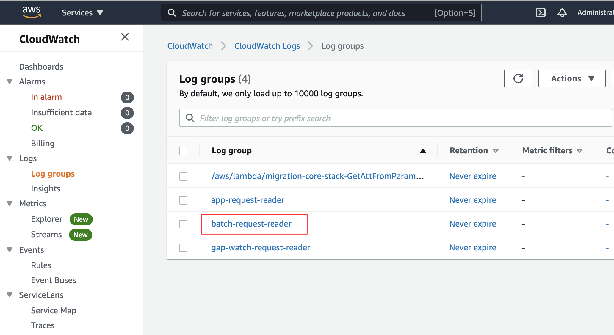

# How to live migrate Azure Cosmos DB for MongoDB API to Amazon DocumentDB (with MongoDB Compatibility)?

Amazon DocumentDB (with MongoDB compatibility) is a fully-managed database service that is compatible with the MongoDB API. The [Amazon DocumentDB Migration Guide](https://docs.aws.amazon.com/documentdb/latest/developerguide/docdb-migration.html#docdb-migration-approaches) outlines three primary approaches for migrating from MongoDB to Amazon DocumentDB: offline, online, and hybrid. Although the migration guide refers to MongoDB, the offline migration approach can be used for Azure Cosmos DB as well. Of these, you can only leverage the offline approach for migrating Cosmos DB to Amazon DocumentDB but not the online and hybrid migration approaches.

This readme document explains how you can use the Azure Cosmos DB to Amazon DocumentDB migration utility tool to migrate your [Azure Cosmos DB for MongoDB API](https://docs.microsoft.com/en-us/azure/cosmos-db/introduction) (with v3.6 wire protocol) to [Amazon DocumentDB](https://docs.aws.amazon.com/documentdb/latest/developerguide/what-is.html).

## Solution overview

The Azure Cosmos DB to Amazon DocumentDB migration utility tool is an application created to help live-migrate Cosmos DB database to Amazon DocumentDB with minimal downtime. The tool keeps the target Amazon DocumentDB cluster in sync with the source Cosmos DB until the client applications are cutover to Amazon DocumentDB cluster. It makes use of the [Change feed in Azure Cosmos DB](https://docs.microsoft.com/en-us/azure/cosmos-db/change-feed) to record the changes and replay them on Amazon DocumentDB cluster. To accomplish this goal, I use the following services:

- Amazon DocumentDB – Stores the data migrated from Cosmos DB
- AWS Lambda – Captures and saves the Change feed data from Cosmos DB
- AWS Secrets Manager – Stores the database credentials for use by AWS Lambda function
- Amazon S3 – Used to store the Change feed data in JSON format
- Amazon DynamoDB – Used for metadata and tracking information of Change feed data

A high-level overview of the migration process is as follows

1. Preparation of the environment for the migration
   1. Create an Amazon Elastic Compute Cloud (Amazon EC2) instance
   2. Install the required packages using yum
   3. Download the source code, binaries, and install the dependencies
   4. Create Amazon Simple Storage Service (Amazon S3) bucket and copy [AWS Lambda](https://aws.amazon.com/lambda/) files using [AWS Command Line Interface](https://aws.amazon.com/cli/) (AWS CLI)
   5. Create core resources using [AWS CloudFormation](https://aws.amazon.com/cloudformation/) template
   6. Create Amazon DocumentDB resources using CloudFormation template
   7. Save Amazon DocumentDB connection string in [AWS Secrets Manager](https://aws.amazon.com/secrets-manager/)
2. The migration process
   1. Start the migrator-app application with required environment variables to capture the change feed data.
   2. Create backup of Cosmos DB cluster using [mongodump](https://docs.mongodb.com/v3.6/reference/program/mongodump/).
   3. Create indexes on the target cluster using [Amazon DocumentDB Index Tool](https://github.com/awslabs/amazon-documentdb-tools/tree/master/index-tool)
   4. Restore the backup on the target cluster using the [mongorestore](https://docs.mongodb.com/v3.6/reference/program/mongorestore/) tool
   5. Configure the event-writer application to apply the change feed data on the target Amazon DocumentDB cluster
   6. Validate the target cluster is in sync with the source cluster
3. The Cutover process
   1. Stop the application from writing to the source Cosmos DB cluster
   2. Stop the migrator-app application that records the change feed data
   3. Restart the client applications with the connection string pointing to Amazon DocumentDB cluster

## High-level architecture diagram


## Assumptions about the required resources for the migration

I have provided AWS [CloudFormation templates](src/cloudformation) to simplify the deployment of the required resources. This CloudFormation template requires the following

1.	AWS environment with [Virtual Private Cloud](https://aws.amazon.com/vpc/) containing three private subnets.
2.	An Amazon EC2 instance for running the migration tools and applications.
3.	The Amazon EC2 instance is created within a private subnet of the above VPC.
4.	Python modules from [Python Package Index](https://pypi.org/) either preloaded or downloaded from public repository (internet access required).
5.	The Cosmos DB cluster will incur higher activity than normal during the migration. You need to review the [Request Units](https://docs.microsoft.com/en-us/azure/cosmos-db/request-units) capacity needs for your Cosmos DB cluster

## Step 1 - Preparation of the environment for the migration

The migration-app application tool supports the migration of data from Cosmos DB's API for MongoDB (3.6 version). If the source cluster is using wire protocol support v3.2 then please [upgrade the source deployment](https://docs.microsoft.com/en-us/azure/cosmos-db/mongodb-version-upgrade) and [MongoDB application drivers](https://docs.mongodb.com/drivers/) to the v3.6 version or above.

> Note: Wherever possible, both the terminal commands and the screenshots for the management console are included. Please use either of these approaches based on your preference.

### Step 1.1 - Create an EC2 instance

**Using management console/GUI:**

Using [AWS Management Console](https://aws.amazon.com/console/), create an Amazon EC2 instance in a private subnet of a VPC with settings as shown below. I have attached the security groups to allow inbound [SSH](https://en.wikipedia.org/wiki/SSH_(Secure_Shell)) traffic on port 22 and inbound Amazon DocumentDB traffic on port 27017 from this instance. For more information on how to create the security groups refer to [Work with security groups](https://docs.aws.amazon.com/AWSEC2/latest/UserGuide/working-with-security-groups.html) documentation.  

I am using `m5ad.xlarge` with vCPU: 4 and RAM: 16 GB. If your source cluster has multiple collections with millions of documents, consider creating an Amazon EC2 instance with higher vCPU and RAM to leverage parallel processing.


### Step 1.2 - Install the required packages using yum

Connect to the above Amazon EC2 instance using SSH and install the required yum packages using the below bash script. For more information on how to connect to an Amazon EC2 instance in private subnet using a bastion, refer the blog post - [Securely Connect to Linux Instances Running in a Private Amazon VPC](https://aws.amazon.com/blogs/security/securely-connect-to-linux-instances-running-in-a-private-amazon-vpc/).

**Using terminal commands/script:**

```bash
# Configure the package manager to include MongoDB v3.6 repo
cat <<EOF | sudo tee /etc/yum.repos.d/mongodb-org-3.6.repo
[mongodb-org-3.6]
name=MongoDB Repository
baseurl=https://repo.mongodb.org/yum/amazon/2013.03/mongodb-org/3.6/x86_64/
gpgcheck=1
enabled=1
gpgkey=https://www.mongodb.org/static/pgp/server-3.6.asc
EOF

# Install python3, pip3, mongodb shell, and mongodb tools
sudo yum update -y
sudo yum install -y amazon-linux-extras
sudo yum install -y python3-pip python3 python3-setuptools mongodb-org-shell mongodb-org-tools
```

### Step 1.3 - Download the source code, binaries, and install the dependencies

Use the below bash script to download the cosmodb-migrator tool binaries and install the Python module dependencies.

```bash
# Change directory to your favorite directory and download source from GitHub repo
cd ~
curl -OL 'https://github.com/awslabs/amazon-documentdb-tools/archive/refs/heads/master.zip'
unzip master.zip
sh amazon-documentdb-tools-master/cosmos-db-migration-utility/scripts/build-package.sh
cd amazon-documentdb-tools-master/cosmos-db-migration-utility/build
tar -xvzf cosmosdb-migrator.tgz
rm -f cosmosdb-migrator.tgz
export BASE_DIR=$(pwd)

# Download the module dependencies for Migrator App
cd ${BASE_DIR}/migrator-app
pip3 install -r requirements.txt --user

# Download the module dependencies for Configure App
cd ${BASE_DIR}/configure
pip3 install -r requirements.txt --user
```

### Step 1.4 - Create Amazon S3 bucket and copy AWS Lambda files using AWS CLI

The `cloudformation/core-resources.yaml` CloudFormation template requires that the [AWS Lambda](https://aws.amazon.com/lambda/) functions and [Lambda layers](https://docs.aws.amazon.com/lambda/latest/dg/configuration-layers.html) are uploaded to an Amazon S3 bucket. If you already have an Amazon S3 bucket and would like to make use of it, upload the `lambda/*.zip` to the `/lambda/` path on your Amazon S3 bucket as shown in the below picture. Otherwise, create a new Amazon S3 bucket with a [globally unique name](https://docs.aws.amazon.com/AmazonS3/latest/dev-retired/UsingBucket.html#:~:text=An%20Amazon%20S3%20bucket%20name,until%20the%20bucket%20is%20deleted.) and upload the files to the `/lambda/` path.

**Using management console/GUI:**


**Using terminal commands/script:**

Use the below script to create a new Amazon S3 bucket and upload the `lambda/*.zip` files to the `/lambda/` path. Populate the values of `AWS_DEFAULT_REGION`, `AWS_ACCESS_KEY_ID`, and `AWS_SECRET_ACCESS_KEY` to those of your account. 

```bash
# Please set the below variables with values specific to your AWS environment
export AWS_DEFAULT_REGION="<your-region>"
export AWS_ACCESS_KEY_ID="<your-access-key>"
export AWS_SECRET_ACCESS_KEY="<your-secret-access-key>"
export ACCOUNT_ID=$(aws sts get-caller-identity --query 'Account' --output text)
```

The below script creates a new Amazon S3 bucket using your AWS credentials. 

```bash
# Create Amazon S3 bucket to hold the AWS Lambda files. 
export BUCKET_NAME="${ACCOUNT_ID}-${AWS_DEFAULT_REGION}-lambda-files"
aws s3api create-bucket --bucket ${BUCKET_NAME} --region ${AWS_DEFAULT_REGION} --create-bucket-configuration LocationConstraint=${AWS_DEFAULT_REGION}
```

If you want to use an existing Amazon S3 bucket instead of creating a new one, populate the value of `BUCKET_NAME`.

```bash
# To reuse an existing Amazon S3 bucket for holding the AWS Lambda files,
# set the below BUCKET_NAME variable to your Amazon S3 bucket name
export BUCKET_NAME="<your-bucket-name>"
```

Run below script to copy the files from Lambda to Amazon S3 bucket.

```bash
# Upload the AWS Lambda function zip files to S3 BUCKET_NAME/lambda/ folder
aws s3 cp "${BASE_DIR}/lambda/" "s3://${BUCKET_NAME}/lambda/" --recursive
```

### Step 1.5 - Create core resources using CloudFormation template

The `cloudformation/core-resources.yaml` CloudFormation template is a shared resource stack that can be reused across multiple Cosmos DB to Amazon DocumentDB cluster migrations. When this template runs successfully, all the required resources for the migration, such as the [Amazon S3](https://aws.amazon.com/s3/) bucket, [Amazon Simple Queue Service](https://aws.amazon.com/sqs/) (SQS) queues, [Amazon Lambda](https://aws.amazon.com/lambda/), and [Amazon DynamoDB](https://aws.amazon.com/dynamodb/) are created and configured automatically.

**Using management console/GUI:**

Create a new Stack using the `cloudformation/core-resources.yaml` template as shown in the below screenshot.


On the next screen specify the stack details as shown below. Select the VPC network and Private subnets appropriate to your environment, and specify the Amazon S3 bucket name that was used in `Step 1.4 - Create Amazon S3 bucket and copy AWS Lambda files using AWS CLI`. As a best practice, I recommend naming your Amazon DocumentDB cluster with same name as the source Cosmos DB cluster. It will help easily identify the mapping between the source and target during the migration process.


Review the core resources stack, then click Deploy.


Confirm the CloudFormation deployment shows a status of `CREATE_COMPLETE` before continuing.


**Using terminal commands/script:**

Use the below script to create a stack using the `cloudformation/core-resources.yaml` template from terminal.

> Note: As a best practice, I recommend naming your Amazon DocumentDB cluster with same name as the source Cosmos DB cluster. It will help easily identify the mapping between the source and target during the migration process. Please replace any references to `<ACCOUNT_ID>`, `<your-vpc-id>`, `<your- private-subnet-id1>`, `<your-private-subnet-id2>`, `<your-private-subnet-id3>`, and `<your-bucket-name>` with appropriate values for your environment.

```bash
cd ${BASE_DIR}
# Create the migration core resources stack
export ACCOUNT_ID=$(aws sts get-caller-identity --query 'Account' --output text)
export BUCKET_NAME="<your-bucket-name>"
# export BUCKET_NAME="${ACCOUNT_ID}-${AWS_DEFAULT_REGION}-lambda-files"
export VPCID="<your-vpc-id>"
export SUBNET_IDS="<your-private-subnet-id1>,<your-private-subnet-id2>,<your-private-subnet-id3>"

aws cloudformation create-stack --stack-name 'migration-core-stack' --template-body file://src/cloudformation/core-resources.yaml --capabilities CAPABILITY_NAMED_IAM --parameters ParameterKey=vpcID,ParameterValue=${VPCID} ParameterKey=subnetIDs,ParameterValue=${SUBNET_IDS} ParameterKey=s3BucketLambdaFiles,ParameterValue=${BUCKET_NAME}
```

### Step 1.6 - Create Amazon DocumentDB resources using CloudFormation template

The `cloudformation/documentdb.yaml` [CloudFormation](https://aws.amazon.com/cloudformation/) template helps you create Amazon DocumentDB cluster with a three compute instances. Use this template file to create a new Amazon DocumentDB cluster for every Cosmos DB cluster being migrated. 

**Using management console/GUI:**

Create a new Amazon DocumentDB Stack using the `cloudformation/documentdb.yaml` template as shown in the below screenshot.


On the next screen specify the stack details as shown below. Please select the VPC network, the Private subnets, the Security Group for Amazon DocumentDB, and Administrator Password with values appropriate for your environment, and provide a unique stack name for the migration. I recommend you to use an [Amazon DocumentDB instance types](https://docs.aws.amazon.com/documentdb/latest/developerguide/db-instance-classes.html#db-instance-class-specs) that is close to your Cosmos DB cluster size.


Confirm the CloudFormation deployment shows a status of `CREATE_COMPLETE` before continuing.


### Step 1.7 - Save Amazon DocumentDB connection string in AWS Secrets Manager

Using the browser, navigate to the `AWS Management Console` > `DocumentDB` > `<your-cluster>` > `Connectivity & Security` > `Connect` and click on `copy` button next to `Connect to this cluster with an application`. Paste and edit the text in your favorite text editor and replace the `<insertYourPassword>` with the password used in the above step. 



Save the connection string information in [AWS Secrets Manager](https://aws.amazon.com/secrets-manager/) as shown below. Please make sure to update the values for `<your-cluster-name>` and `<your-documentdb-connection-string>`. The AWS Lambda function `batch-request-reader` makes use of this connection string to apply the change feed data on the target Amazon DocumentDB cluster.

**Using terminal commands/script:**

```bash
# Configure the connection string for your application
# Note: The connection string is saved in AWS Secrets Manager.
cd ${BASE_DIR}/configure
python3 main.py --cluster-name <your-cluster-name> --connection-string "<your-documentdb-connection-string>"
```

## Step 2 - The migration process

### Step 2.1 - Start the migrator-app application

The next step in the live migration process is to use the migration application to capture the change feed data from Cosmos DB cluster. The application saves the data into the Amazon S3, then stores the metadata and tracking information in Amazon DynamoDB Tables. Start the migration application using below the commands. Update the values for `<your-cosmosdb-connection-string>` and `<your-cluster-name>` with values appropriate for your cluster.

> **Important Note**: Keep the `migrator-app` application running until the cutover period. For large database migrations, I strongly recommend you to run below commands in a [screen session](https://linuxize.com/post/how-to-use-linux-screen/) or run with the `nohup` command to ensure that the migrator-app doesn’t get killed when you log out.

**Using terminal commands/script:**

```bash
cd ${BASE_DIR}/migrator-app
export ACCOUNT_ID=$(aws sts get-caller-identity --query 'Account' --output text)
export S3_CHANGE_FEED_BUCKET_NAME="${ACCOUNT_ID}-${AWS_DEFAULT_REGION}-change-feed"
export SOURCE_URI="<your-cosmosdb-connection-string>"
# Start the migrator app. Use nohup or screen session for large database migrations
python3 main.py  --cluster-name <your-cluster-name>
```

After running the above command, you should observe an output similar to below

```bash
# Sample output: 
# 2020-05-12 17:24:13 INFO     [commandline_parser.py:23]  Command line arguments given: {"cluster_name": "app-name"}
# 2020-05-12 17:24:13 INFO     [ClusterMigrator.py:25]  Initializing the cluster migrator with connection string: mongodb://...
# ...
# 2020-05-12 17:24:13 INFO     [main.py:49]  Found the following namespaces on cluster_name: app-name. Namespaces: {"Northwind": ["employees", "regions", "customers", "order-details", "orders", "suppliers", "employee-territories", "products", "northwind", "territories", "shippers", "categories"], "TradeBlotter": ["trades"], "appname": ["info"], "social": ["people"], "test": ["movies"]}
# 2020-05-12 17:24:13 INFO     [dynamodb_helper.py:50]  Getting the watcher item by id: app-name::Northwind.employees
# 2020-05-12 17:24:14 INFO     [dynamodb_helper.py:58]  Successfully found the watcher item for id: app-name::Northwind.employees.
# ...
# 2020-05-12 17:24:15 INFO     [dynamodb_helper.py:19]  database: Northwind, collections: ["employees", "regions", "customers", "order-details", "orders", "suppliers", "employee-territories", "products", "northwind", "territories", "shippers", "categories"]
# ...
# 2020-05-12 17:24:16 INFO     [CollectionMigrator.py:124]  Inititated change stream on the db: Northwind, collection: employees. Resume Token: {"_data": {"$binary": "W3sidG9rZW4iOiJcIjBcIiIsInJhbmdlIjp7Im1pbiI6IiIsIm1heCI6IkZGIn19XQ==", "$type": "00"}}
# 2020-05-12 17:24:16 INFO     [DatabaseMigrator.py:21]  Fetching collections from Database: appname
# 2020-05-12 17:24:16 INFO     [CollectionMigrator.py:137]  Watching for the changes on the cluster: app-name, db: Northwind, collection: employees
# ...
```

### Step 2.2 - Create backup of Cosmos DB cluster using the mongodump tool

In a brand-new terminal session, export the data and indexes from the source Cosmos DB cluster using the [mongodump](https://docs.mongodb.com/v3.6/reference/program/mongodump/) tool. The time it takes to perform the dump and the size of the dump depends on the data size of the source Cosmos DB cluster. Please ensure that the disk device where you are exporting the data has enough free disk space to hold the mongodump output. Other factors that may impact the overall execution time include the speed of the network between the Amazon EC2 instance and the source cluster, and the CPU/RAM resources of the Amazon EC2 instance. Update the values for `<your-cosmosdb-connection-string>`, `<your-cosmos-db-server>`, `<your-username>`, and `<your-password>` with values appropriate for your cluster.

**Using terminal commands/script:**

```bash
export SOURCE_URI="<your-cosmosdb-connection-string>"
mongodump --host "<your-cosmos-db-server>" --port 10255 --ssl -u "<your-username>" -p '<your-password>' --readPreference secondary
```

> Note: To minimize the impact of the migration to any workload on the source cluster's primary, export the data using secondary read preference. If your source cluster does not have a secondary then exclude the `--readPreference` command line argument. If you have multiple collections to export, use the argument `--numParallelCollections <number-of-cpu-cores>` to [dump multiple collections in parallel](https://docs.mongodb.com/database-tools/mongodump/#std-option-mongodump.--numParallelCollections).

### Step 2.3 Create indexes on the target cluster using the Amazon DocumentDB Index Tool

Using Amazon DocumentDB Index Tool create the required indexes on Amazon DocumentDB cluster.

### Step 2.4 - Restore the backup on the target cluster using the mongorestore tool

Restore the mongodump data from the `Step 2.2 - Create backup of Cosmos DB cluster using the mongodump tool`. If you have multiple collections to import, use the argument --numParallelCollections `<number-of-cpu-cores>` to [restore multiple collections in parallel](https://docs.mongodb.com/database-tools/mongorestore/#std-option-mongorestore.--numParallelCollections). Increasing the value of `–-numInsertionWorkersPerCollection` argument to the number of vCPU cores on Amazon DocumentDB cluster’s primary instance may increase the speed of the import. Update the values for `<your-documentdb-server>`, `<number-of-vcpus>`, `<your-username>`, and `<your-password>` with values appropriate for your cluster.

**Using terminal commands/script:**

```bash
# Download the ca certificate for connecting to Amazon DocumentDB
curl -OL https://s3.amazonaws.com/rds-downloads/rds-combined-ca-bundle.pem
# Restore the dump data on the target Amazon DocumentDB cluster using mongorestore
mongorestore --host "<your-documentdb-server>" –-ssl –-sslCAFile rds-combined-ca-bundle.pem --username "<your-username>" --password '<your-password>' –-numInsertionWorkersPerCollection <number-of-vcpus>
```

### 2.5 - Configure the event-writer to apply the change feed data

The `mongodump` and `mongorestore` processes will take time depending upon the Cosmos DB and Amazon DocumentDB cluster configuration, and the size of the data/indexes being exported/imported. Once the `mongorestore` step is completed, you should configure the migration application to start applying the change feed data on the target Amazon DocumentDB.
The below commands will help you configure the event-writer to start processing the change feed data. Update the values for `<your-cluster-name>` with values appropriate for your cluster.


**Using terminal commands/script:**

```bash
# Use Configure App to start applying the change feed data
cd ${BASE_DIR}/configure
python3 main.py --cluster-name '<your-cluster-name>' --event-writer start
```

After running the above command, you should observe an output similar to below

```bash
# Sample output:
# 2020-05-12 17:30:04 INFO     [commandline_parser.py:27]  Command line arguments given: {"cluster_name": "app-name", "connection_string": null, "event_writer": "start", "status": false, "watch_status": false}
# 2020-05-12 17:30:04 INFO     [commandline_parser.py:46]  Validated Command line arguments are: {"cluster_name": "app-name", "connection_string": null, "event_writer": "start", "status": false, "watch_status": false, "command": "event_writer"}
# 2020-05-12 17:30:04 INFO     [main.py:41]  Starting to configure application components with commandline_options: {"cluster_name": "app-name", "connection_string": null, "event_writer": "start", "status": false, "watch_status": false, "command": "event_writer"}
# 2020-05-12 17:30:04 INFO     [application.py:40]  Setting the event writer status as start
# 2020-05-12 17:30:04 INFO     [application.py:49]  Starting to send SQS requests to queue: app-request-queue. Payload: {"cluster_name": "app-name", "component": "event_writer", "operation": "start"}
# 2020-05-12 17:30:05 INFO     [application.py:55]  Successfully completed sending SQS requests to queue: app-request-queue. Response: {'MD5OfMessageBody': '61dcb7532416d2b837e918bc74bdea9a', 'MessageId': '144febb8-d4e9-47b7-8e31-bdd9207ae7c0', 'ResponseMetadata': {'RequestId': '3906f72c-84f0-5e7f-b701-a1d0f1ddf39e', 'HTTPStatusCode': 200, 'HTTPHeaders': {'x-amzn-requestid': '3906f72c-84f0-5e7f-b701-a1d0f1ddf39e', 'date': 'Mon, 30 Mar 2020 22:30:05 GMT', 'content-type': 'text/xml', 'content-length': '378'}, 'RetryAttempts': 0}}
# 2020-05-12 17:30:05 INFO     [application.py:45]  Successfully completed setting the event writer status as start
# 2020-05-12 17:30:05 INFO     [main.py:51]  Successfully completed configuring the application components.
```

### Step 2.6 – Validate the target cluster is in sync with the source cluster

The AWS Lambda functions from the CloudFormation stack will start applying the change feeds on the target Amazon DocumentDB in the order in which they happened on the source. You can observe the status of the migration application using the below command to see how far the target cluster is behind the source cluster.

**Using terminal commands/script:**

```bash
# Watch the status of the migration
cd ${BASE_DIR}/configure
python3 main.py --cluster-name `<your-cluster-name>` --watch-status
```

After running the above command, you should observe an output similar to below

```bash
# Sample output:
# 2020-05-12 17:30:35 INFO     [commandline_parser.py:27]  Command line arguments given: {"cluster_name": "app-name", "connection_string": null, "event_writer": null, "status": false, "watch_status": true}
# 2020-05-12 17:30:35 INFO     [commandline_parser.py:46]  Validated Command line arguments are: {"cluster_name": "app-name", "connection_string": null, "event_writer": null, "status": false, "watch_status": true, "command": "watch_status"}
# 2020-05-12 17:30:35 INFO     [main.py:41]  Starting to configure application components with commandline_options: {"cluster_name": "app-name", "connection_string": null, "event_writer": null, "status": false, "watch_status": true, "command": "watch_status"}
# 2020-05-12 17:30:35 INFO     [application.py:64]  Status: {
#  "gap_in_seconds": 9,
#  "details": [
#   {
#    "cluster_name": "app-name",
#    "namespace": "social.people",
#    "batch_id": 673,
#    "created_timestamp": "2020-03-22T02:57:38.589018",
#    "processed_timestamp": "2020-03-22T02:57:47.299929",
#    "time_gap_in_seconds": 9
#   },
#   {
#    "cluster_name": "app-name",
#    "namespace": "appname.info",
#    "batch_id": 598,
#    "created_timestamp": "2020-03-22T02:57:41.889158",
#    "processed_timestamp": "2020-03-22T02:57:48.716314",
#    "time_gap_in_seconds": 7
#   }
#  ],
#  "current_time": "2020-03-30T22:30:29.562611",
#  "cluster_name": "app-name"
# }
```

The `gap_in_seconds` represents the time gap between the source and target cluster operations. The `time_gap_in_seconds` in details section represents time gap between the source and the target at collection level. Once the `gap_in_seconds` from the above status output is under 10 seconds, you can continue to the next step.

### Step 3 - Cutover process

This process involves updating your source application to connect to the target Amazon DocumentDB cluster. Since the migration application has multiple components, the process required to follow is

1. Stop the applications connected to Cosmos DB or place them in read-only mode.
2.	Stop the `migrator-app` and configure `--watch-status` applications by terminating the python processes (press Ctrl+C).
3.	Stop the event-writer by running the following commands  
   ```bash
   # Stop applying the change feed data
   cd ${BASE_DIR}/configure
   python3 main.py --cluster-name `<your-cluster-name>` --event-writer stop
   ```
4. Restart the client applications with connection string pointing to Amazon DocumentDB cluster endpoint

Once you perform all the above steps from the cutover process successfully, your database is fully migrated to Amazon DocumentDB cluster with minimal downtime.

## Troubleshooting Tips

### Errors while executing migrator-app

If the `configure` application with `--watch-status` is not making any progress, try to stop and restart the application using the following commands. 

**Using terminal commands/script:**

```bash
cd ${BASE_DIR}/configure
# Stop applying the change feed data
python3 main.py --cluster-name `<your-cluster-name>` --event-writer stop
# Wait for 2 minutes
# Start applying the change feed data
python3 main.py --cluster-name `<your-cluster-name>` --event-writer start
```

If following these commands still does not fix the issue, search for error text in `CloudWatch > Log Groups > batch-request-reader` to identify what's causing the issue.



### CloudFormation template stack doesn’t make progress

If the "`core-resources.yaml`" CloudFormation template doesn’t make progress while creating/deleting the resource, it could be possible that the CloudFormation is facing some issues while creating/deleting the `EventSourceMapping` resources. Login to the CloudTrail console and examine the Event History for any FAILED events such as below.

```log
2020-05-11 10:22:17 UTC-0500	lambdaEventMappingGapWatchRequest	CREATE_FAILED	An event source mapping with SQS arn (" arn:aws:sqs:us-east-2:677862827933:gap-watch-request-queue ") and function (" gap-watch-request-reader ") already exists. Please update or delete the existing mapping with UUID fa8a6a95-9f4e-4539-9934-94210123bb0b (Service: AWSLambda; Status Code: 409; Error Code: ResourceConflictException; Request ID: 3aa276bc-4124-4af0-a2e3-38a94a478997)
```

Capture the UUID from the above log output, and manually delete the resource using the AWS CLI.

```bash
# Change the --uuid value with the value you found in the logs
aws lambda delete-event-source-mapping --uuid 28c11ac1-407d-4eec-8063-c2d1545e4f24
```


For more information on identifying which resource is blocking, please refer to article [Why is my AWS CloudFormation stack stuck in the state](https://aws.amazon.com/premiumsupport/knowledge-center/cloudformation-stack-stuck-progress/)

## Summary

Using Azure Cosmos DB to Amazon DocumentDB migration utility tool you can perform a live migration of [Azure Cosmos DB](https://docs.microsoft.com/en-us/azure/cosmos-db/introduction) for MongoDB API database to [Amazon DocumentDB](https://docs.aws.amazon.com/documentdb/latest/developerguide/what-is.html) (with MongoDB compatibility) with minimal downtime. The tool keeps the target Amazon DocumentDB cluster in sync with the changes on the source Cosmos DB, and helps to minimize the overall application downtime as you perform the migration. 

If you need additional expertise to accelerate the success of your migration projects to Amazon DocumentDB, contact your AWS Account team to learn more about [AWS Professional Services](https://aws.amazon.com/professional-services/) migration offerings. The AWS Professional Services (ProServe) organization is a global team of experts with years of experience across multiple customers. AWS ProServe can provide specialized skill augmentation, focused guidance, strategy, roadmap proposal, and streamlined process to accelerate your migration projects.