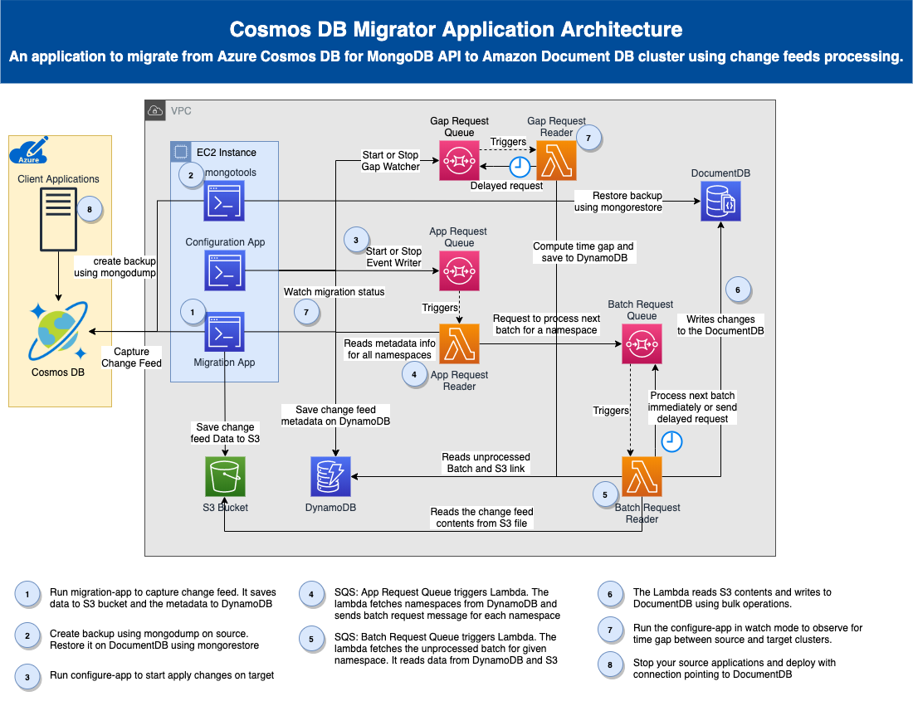
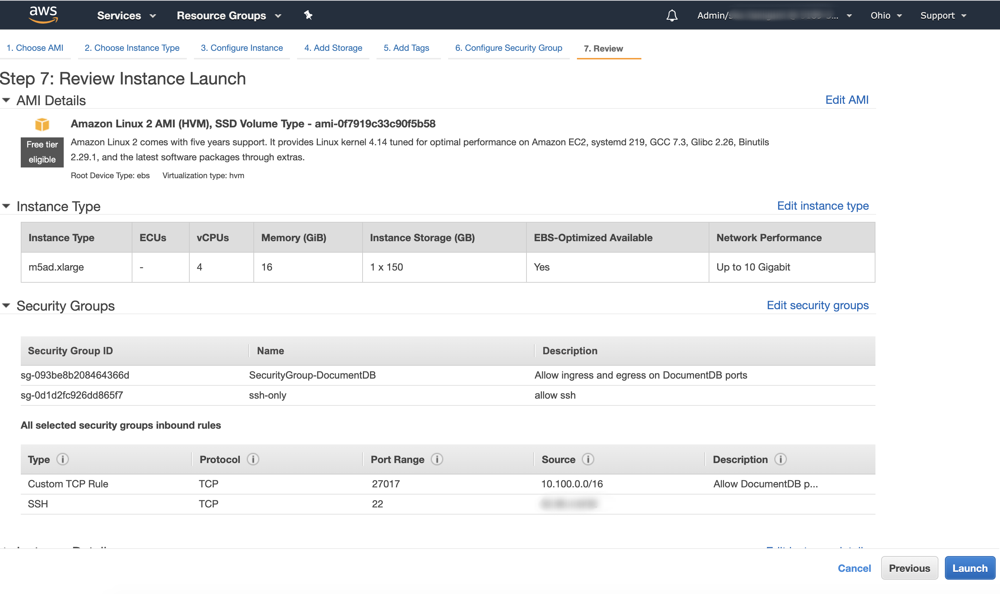
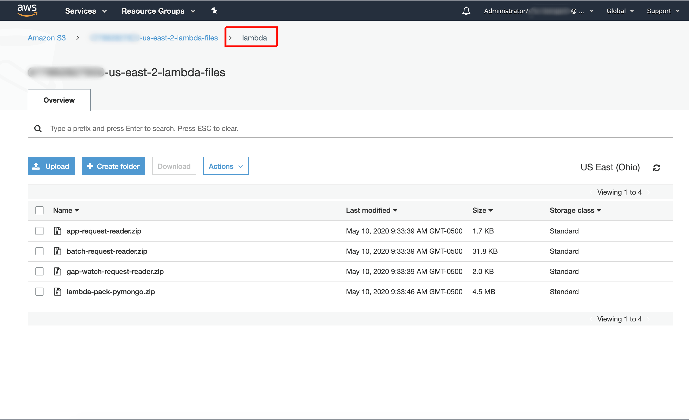
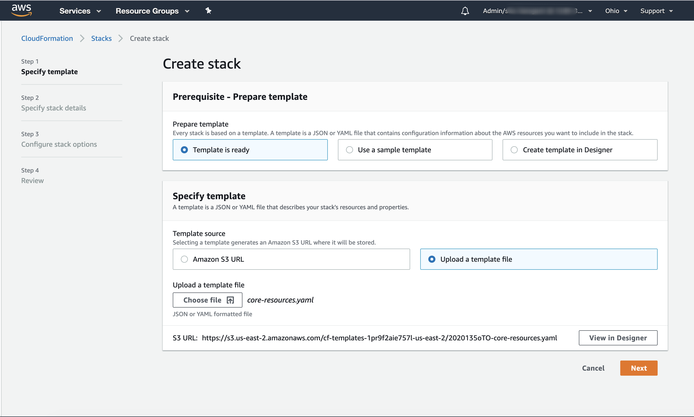
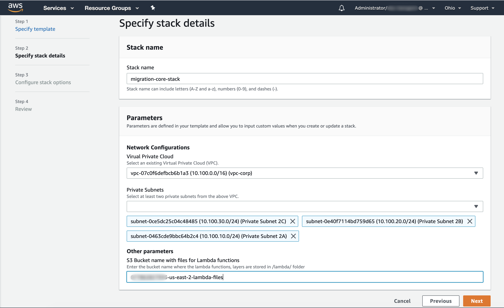
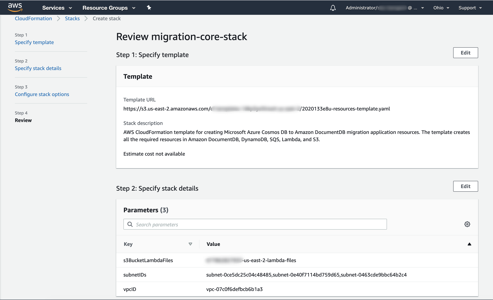
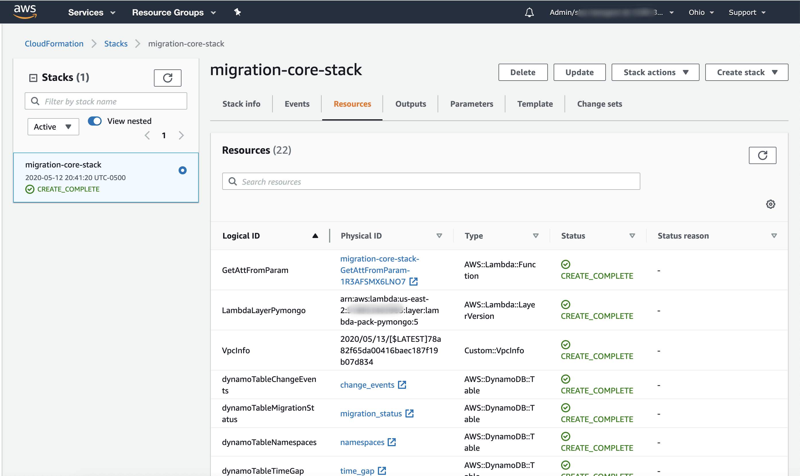
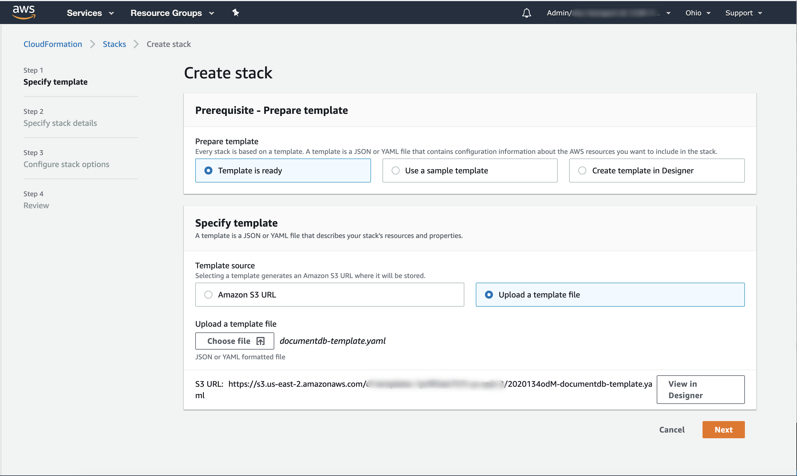
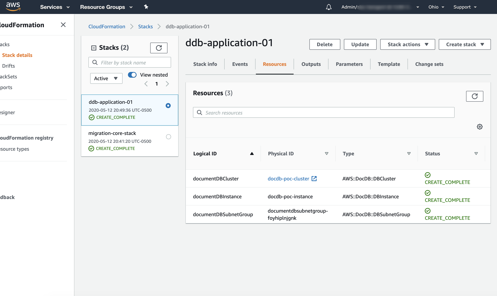

# Live migrate Azure Cosmos DB for MongoDB API to Amazon DocumentDB

The Amazon DocumentDB (with MongoDB compatibility) is a fully managed database service that is compatible with the MongoDB API. You can migrate your data to [Amazon DocumentDB](https://docs.aws.amazon.com/documentdb/latest/developerguide/what-is.html) from [Azure Cosmos DB for MongoDB API](https://docs.microsoft.com/en-us/azure/cosmos-db/introduction) databases running on [Microsoft Azure cloud services](https://docs.microsoft.com/en-us/azure/) using the process detailed in this section. 

## Overview

The [Amazon DocumentDB Migration Guide](https://docs.aws.amazon.com/documentdb/latest/developerguide/docdb-migration.html#docdb-migration-approaches) outlines three primary approaches for migrating from MongoDB to Amazon DocumentDB: offline, online, and hybrid. Although the migration guide refers to MongoDB, the offline migration approach can be used for Cosmos DB as well. The online and hybrid migration approaches from Azure Cosmos DB for MongoDB API aren't supported by the [AWS Database Migration Service](https://aws.amazon.com/dms/) (AWS DMS) yet. 

The `Cosmos DB Migrator` is an application created to help live migrate the Azure Cosmos DB for MongoDB API databases to Amazon DocumentDB with very little downtime. It keeps the target DocumentDB cluster in sync with the source Cosmos DB until the client applications are cut over to the DocumentDB cluster. This solution makes use of [Change feed in Azure Cosmos DB for MongoDB API](https://docs.microsoft.com/en-us/azure/cosmos-db/change-feed) to record the changes. Using the [mongodump](https://docs.mongodb.com/manual/reference/program/mongodump/) and [mongorestore](https://docs.mongodb.com/manual/reference/program/mongorestore/) tools the data from the source Azure Cosmos DB for MongoDB API deployment is migrated to the target Amazon DocumentDB cluster. Once the mongorestore process is complete, configure the migrator application to start applying the change feeds on the Amazon DocumentDB cluster. As the time progresses the target DocumentDB cluster will be only a few seconds behind the source Cosmos DB cluster. When the target cluster is only 10 seconds behind the source, a cut over plan can be rolled out where the source application will be redeployed with a new connection string pointing to target Amazon DocumentDB cluster.

This migration approach has following steps:

1. Run the `migrator-app` to track and record the change feed on Cosmos DB.
2. Dump the indexes and data from source cluster using `mongodump` tool.
3. Restore the data and indexes to the DocumentDB cluster using the `mongorestore` tool.
4. Configure the application to apply the change feeds on DocumentDB cluster.
5. Watch and wait for the target to get caught up with changes on source cluster.
6. Stop application writes to the source Cosmos DB deployment.
7. Redeploy the client applications with connection string pointing to the Amazon DocumentDB cluster.

## Architecture diagram



The architecture diagram in [drawio](https://drawio-app.com/) and [png](https://en.wikipedia.org/wiki/Portable_Network_Graphics) format are available in the [docs/architecture](./docs/architecture/) folder.

## Assumptions

1. Virtual Private Cloud with two or more private subnets. 
2. An EC2 instance is used for this migration. 
   1. is created within private subnet of the above VPC.
   2. can establish outbound connections to the Internet for installing Python modules.
3. Cosmos DB has RUs to support daily workload and the migration.

## Setting up of environment for the migration

The application supports migration of data from Azure Cosmos DB's API for MongoDB (3.6 version). If the source cluster is using wire protocol support v3.2 then please upgrade the source deployment and application drivers to 3.6 version. 

To prepare for the migration, the following resources are needed

1. Azure Cosmos DB's for MongoDB API source cluster with v3.6 wire protocol support.
2. CloudFormation templates for migration-core stack and Amazon DocumentDB stack.
3. Source code for the `configure`, `migrator-app`, and the `lambda` functions
4. An EC2 instance to execute programs, and perform export/import of data.

> Note: Wherever possible, both the terminal commands and the screenshots for the management console are included. Please use either of these approaches based on your preference.

### Step 01: Create an EC2 instance and install the binaries

**Management Console:**

Using AWS Management Console, please create an EC2 instance with settings as shown below. Here I am using `m5ad.xlarge` with vCPU: 4 and RAM: 16 GB. If the source cluster has large dataSize to be migrated, then consider creating an instance with higher vCPU and RAM to leverage parallel processing.



Install all the required packages, binaries on EC2 instance using the below bash script.

**Terminal Commands:**

```bash
# Configure the package manager to include MongoDB v3.6 repo
cat <<EOF | sudo tee /etc/yum.repos.d/mongodb-org-3.6.repo
[mongodb-org-3.6]
name=MongoDB Repository
baseurl=https://repo.mongodb.org/yum/amazon/2013.03/mongodb-org/3.6/x86_64/
gpgcheck=1
enabled=1
gpgkey=https://www.mongodb.org/static/pgp/server-3.6.asc
EOF

# install python3, pip3, mongodb shell and tools
sudo yum update -y
sudo yum install -y amazon-linux-extras
sudo yum install -y python3-pip python3 python3-setuptools mongodb-org-shell mongodb-org-tools
```

```bash
# download the code, unzip, build, use python3/pip3
mkdir cosmosdb-migrator
cd cosmosdb-migrator
export GIT_REPO_URL='https://github.com/awslabs/amazon-documentdb-tools/blob/master/cosmos-db-migration-utility/bin/cosmosdb-migrator.tgz?raw=true'

curl -L ${GIT_REPO_URL} -o cosmosdb-migrator.tgz
tar -xvzf cosmosdb-migrator.tgz
rm -f cosmosdb-migrator.tgz
export BASE_DIR=$(pwd)

# Migrator App: download and build the Python modules
cd ${BASE_DIR}/migrator-app
pip3 install -r requirements.txt --user

# Configure App: download and build the Python modules
cd ${BASE_DIR}/configure
pip3 install -r requirements.txt --user
```

### Step 02: Create a S3 bucket for lambda files

The `core-resources.yaml` CloudFormation template assumes the AWS Lambda functions and layers are available on a S3 bucket. If you already have a S3 bucket and would like to make use of it then upload the `lib/lambda/*.zip` files to `/lambda/` folder as shown in the picture. Otherwise create a S3 bucket with a name of your choice and upload the files to `/lambda/`.

**Management Console:**



**Terminal Commands:**

Use the below script to create a new S3 bucket and upload the `lib/lambda/*.zip` files to `/lambda/` folder. Please make use of appropriate values for the AWS environment variables, and set `BUCKET_NAME` variable to S3 bucket if you want to reuse an existing bucket.

```bash
# Please set these variables for your AWS environment
export AWS_DEFAULT_REGION="<your-region>"
export AWS_ACCESS_KEY_ID="<your-access-key>"
export AWS_SECRET_ACCESS_KEY="<your-secret-access-key>"
```

```bash
# Note: Skip this step if you want to use an existing S3 bucket
# Create a bucket for the lambda files. 
export ACCOUNT_ID=$(aws sts get-caller-identity --query 'Account' --output text)
export BUCKET_NAME="${ACCOUNT_ID}-${AWS_DEFAULT_REGION}-lambda-files"
aws s3api create-bucket --bucket ${BUCKET_NAME} --region ${AWS_DEFAULT_REGION} --create-bucket-configuration LocationConstraint=${AWS_DEFAULT_REGION}

# If you already have a S3 bucket and would like to use it for lambda files
# set below BUCKET_NAME variable to your S3 bucket of interest
export BUCKET_NAME="<your-bucket-name>"
```

Run below script to create a lambda code zip files and upload them to S3 bucket.

```bash
# upload zip files to S3 BUCKET_NAME/lambda/ folder
aws s3 cp ${BASE_DIR}/lambda/ s3://${BUCKET_NAME}/lambda/ --recursive
```

### Step 03: Create core resources using CloudFormation template

The `core-resources.yaml` [CloudFormation](https://aws.amazon.com/cloudformation/) template helps create all the core resources required for the migration process. Resources such as [Amazon S3](https://aws.amazon.com/s3/) bucket, [Amazon Simple Queue Service](https://aws.amazon.com/sqs/) (SQS) queues, [Amazon Lambda](https://aws.amazon.com/lambda/), and [Amazon DynamoDB](https://aws.amazon.com/dynamodb/) are created and configured when a stack is created using the CloudFormation template. 

**Management Console:**

Create a new Stack using the `core-resources.yaml` template as show in the below screenshot.



On the next screen specify the stack details as shown below. Please select the VPC network and the Private subnets accordingly. Please specify the S3 bucket name that was used in `Step 01: Create a S3 bucket for lambda files` section.



Review the core resources stack and create the stack.



Please wait until core resources stack runs to completion successfully.



**Terminal Commands:**

Use the below script to create a stack using the `core-resources.yaml` template from terminal.

> Note: While creating the Amazon DocumentDB cluster, please use the same cluster name as the source Cosmos DB Account name. This will help you easily identify the mapping between the source and target. Please use the same name for any references to `<your-cluster-name>` in this document.

```bash
cd ${BASE_DIR}
# create the migration core resources stack
ACCOUNT_ID=$(aws sts get-caller-identity --query 'Account' --output text)
BUCKET_NAME="${ACCOUNT_ID}-${AWS_DEFAULT_REGION}-lambda-files"
VPCID="<your-vpc-id>"
SUBNET_IDS="<your-private-subnet-id1>,<your-private-subnet-id2>"
aws cloudformation create-stack --stack-name 'migration-core-stack' --template-body file://src/cloudformation/core-resources.yaml --capabilities CAPABILITY_NAMED_IAM --parameters ParameterKey=vpcID,ParameterValue=${VPCID} ParameterKey=subnetIDs,ParameterValue=${SUBNET_IDS} ParameterKey=s3BucketLambdaFiles,ParameterValue=${BUCKET_NAME}
```

### Step 04: Create DocumentDB resources using CloudFormation template

The `documentdb.yaml` [CloudFormation](https://aws.amazon.com/cloudformation/) template helps create all the DocumentDB related resources. Please use the same template file to create separate DocumentDB clusters for every Azure Cosmos DB for MongoDB API project being migrated. 

**Management Console:**

Create a new DocumentDB Stack using the `documentdb.yaml` template as show in the below screenshot.



On the next screen specify the stack details as shown below. Please select the VPC network, the Private subnets, the Security Group for DocumentDB and unique Project Name for the migration.


Please wait until DocumentDB resources stack runs to completion successfully.



### Step 05: Save the DocumentDB connection string in Secrets Manager 

Using the browser, navigate to the `AWS Management Console` > `DocumentDB` > `<your-cluster>` > `Connectivity & Security` > `Connect` and click on `copy` button next to `Connect to this cluster with an application`. Paste and edit the text in your favorite text editor and replace the `<insertYourPassword>` with the password used in the above step. 

The AWS Lambda function `batch-request-reader` applies the change feed on the Amazon DocumentDB cluster using this connection string. Save the connection string information in AWS Secrets Manager as shown below. Please make sure to update the values for `<your-cluster-name>` and `<your-documentdb-connection-string>`.

**Terminal Commands:**

```bash
# Configure the connection string for your application
# Note: The connection string is saved in AWS Secrets Manager.
cd ${BASE_DIR}/configure
python3 main.py --cluster-name <your-cluster-name> --connection-string "<your-documentdb-connection-string>"
```

### Step 06: Start the migrator-app application

The next step in the live migration process is to capture the changes from the source cluster. The migration application captures the change feed data from Azure Cosmos DB for MongoDB API cluster and saves the data into the AWS S3 and stores the metadata, tracking information in DynamoDB Tables. Start the migration application using below commands. Please make sure to update the values for `<your-source-connection-string>`, `your-s3-change-feed-bucket`, and `<your-cluster-name>`. 

> **Important Note**: Please keep the migrator-app application running until the cut over period. Running this command inside a `screen` session or run with `nohup` command is strongly recommended especially for large database migrations.

**Terminal Commands:**

```bash
cd ${BASE_DIR}/migrator-app
export S3_CHANGE_FEED_BUCKET_NAME="${ACCOUNT_ID}-${AWS_DEFAULT_REGION}-change-feed"
export SOURCE_URI="<your-source-connection-string>"
# start the migrator app
python3 main.py  --cluster-name <your-cluster-name>
# Sample output: 
# 2020-05-12 17:24:13 INFO     [commandline_parser.py:23]  Command line arguments given: {"cluster_name": "app-name"}
# 2020-05-12 17:24:13 INFO     [ClusterMigrator.py:25]  Initializing the cluster migrator with connection string: mongodb://...
# ...
# 2020-05-12 17:24:13 INFO     [main.py:49]  Found the following namespaces on cluster_name: app-name. Namespaces: {"Northwind": ["employees", "regions", "customers", "order-details", "orders", "suppliers", "employee-territories", "products", "northwind", "territories", "shippers", "categories"], "TradeBlotter": ["trades"], "appname": ["info"], "social": ["people"], "test": ["movies"]}
# 2020-05-12 17:24:13 INFO     [dynamodb_helper.py:50]  Getting the watcher item by id: app-name::Northwind.employees
# 2020-05-12 17:24:14 INFO     [dynamodb_helper.py:58]  Successfully found the watcher item for id: app-name::Northwind.employees.
# ...
# 2020-05-12 17:24:15 INFO     [dynamodb_helper.py:19]  database: Northwind, collections: ["employees", "regions", "customers", "order-details", "orders", "suppliers", "employee-territories", "products", "northwind", "territories", "shippers", "categories"]
# ...
# 2020-05-12 17:24:16 INFO     [CollectionMigrator.py:124]  Inititated change stream on the db: Northwind, collection: employees. Resume Token: {"_data": {"$binary": "W3sidG9rZW4iOiJcIjBcIiIsInJhbmdlIjp7Im1pbiI6IiIsIm1heCI6IkZGIn19XQ==", "$type": "00"}}
# 2020-05-12 17:24:16 INFO     [DatabaseMigrator.py:21]  Fetching collections from Database: appname
# 2020-05-12 17:24:16 INFO     [CollectionMigrator.py:137]  Watching for the changes on the cluster: app-name, db: Northwind, collection: employees
# ...
```

### Step 07: Create backup and restore it on target cluster

#### Create backup using mongodump

In a *brand-new* terminal session export the data and indexes from the source Cosmos DB cluster using the `mongodump` tool. The export size and the time it takes to perform the dump depends on the data size of the source Cosmos DB account. Please ensure that the disk device has enough free disk space to hold the mongodump. Other factors for the execution time include the speed of the network between the ec2 instance and the source cluster, and the CPU/RAM resources on the ec2 instance.

**Terminal Commands:**

```bash
export SOURCE_URI="<your-source-connection-string>"
mongodump --host "<your-cosmos-db-server>" --port 10255 --ssl -u "<your-username>" -p '<your-password>' --readPreference secondary
```

> Note: To minimize the impact of the migration to any workload on the source cluster's master/primary, export the data using secondary read preference. If you source cluster does not have a secondary then please exclude `--readPreference` command line option.

#### Restore backup using mongorestore

Restore the exported data to target Amazon DocumentDB cluster using the `mongorestore` tool. Set the `–-numInsertionWorkersPerCollection` option to the number of vCPUs on the Amazon DocumentDB cluster’s primary instance to parallelize imports process using `mongorestore`.

**Terminal Commands:**

```bash
# download the ca certificate for DocumentDB
curl -OL https://s3.amazonaws.com/rds-downloads/rds-combined-ca-bundle.pem
# restore the dump data on target documentdb cluster using mongorestore
mongorestore --host "<your-documentdb-server>" –-ssl –-sslCAFile rds-combined-ca-bundle.pem --username "<your-username>" --password '<your-password>' –-numInsertionWorkersPerCollection <number-of-vcpus>
```

### Step 8: Configure the event-writer and watch the status

The `mongodump` and `mongorestore` process takes some time depending upon the DocumentDB cluster configuration and the size of the data/indexes being imported. All the changes that has happened since the beginning of migration process are being recorded by the `migration-app` from Step 1. Once the `mongorestore` step is completed, you could configure the migration application to start applying these change feeds on the target DocumentDB. 

The below commands will help you configure the event-writer to start processing the change feed data.

**Terminal Commands:**

```bash
# start applying the change feeds
cd ${BASE_DIR}/configure
python3 main.py --cluster-name '<your-cluster-name>' --event-writer start
# 2020-05-12 17:30:04 INFO     [commandline_parser.py:27]  Command line arguments given: {"cluster_name": "app-name", "connection_string": null, "event_writer": "start", "status": false, "watch_status": false}
# 2020-05-12 17:30:04 INFO     [commandline_parser.py:46]  Validated Command line arguments are: {"cluster_name": "app-name", "connection_string": null, "event_writer": "start", "status": false, "watch_status": false, "command": "event_writer"}
# 2020-05-12 17:30:04 INFO     [main.py:41]  Starting to configure application components with commandline_options: {"cluster_name": "app-name", "connection_string": null, "event_writer": "start", "status": false, "watch_status": false, "command": "event_writer"}
# 2020-05-12 17:30:04 INFO     [application.py:40]  Setting the event writer status as start
# 2020-05-12 17:30:04 INFO     [application.py:49]  Starting to send SQS requests to queue: app-request-queue. Payload: {"cluster_name": "app-name", "component": "event_writer", "operation": "start"}
# 2020-05-12 17:30:05 INFO     [application.py:55]  Successfully completed sending SQS requests to queue: app-request-queue. Response: {'MD5OfMessageBody': '61dcb7532416d2b837e918bc74bdea9a', 'MessageId': '144febb8-d4e9-47b7-8e31-bdd9207ae7c0', 'ResponseMetadata': {'RequestId': '3906f72c-84f0-5e7f-b701-a1d0f1ddf39e', 'HTTPStatusCode': 200, 'HTTPHeaders': {'x-amzn-requestid': '3906f72c-84f0-5e7f-b701-a1d0f1ddf39e', 'date': 'Mon, 30 Mar 2020 22:30:05 GMT', 'content-type': 'text/xml', 'content-length': '378'}, 'RetryAttempts': 0}}
# 2020-05-12 17:30:05 INFO     [application.py:45]  Successfully completed setting the event writer status as start
# 2020-05-12 17:30:05 INFO     [main.py:51]  Successfully completed configuring the application components.
```

### Step 09: Watch the migration status

The AWS Lambda functions will start applying the change feeds on the target Document DB in the order in which they happened on source. You can observe the status of the migration application using below command to see how far the target cluster is behind the source.

**Terminal Commands:**

```bash
# watch the migration status continuously
cd ${BASE_DIR}/configure
python3 main.py --cluster-name `<your-cluster-name>` --watch-status
# 2020-05-12 17:30:35 INFO     [commandline_parser.py:27]  Command line arguments given: {"cluster_name": "app-name", "connection_string": null, "event_writer": null, "status": false, "watch_status": true}
# 2020-05-12 17:30:35 INFO     [commandline_parser.py:46]  Validated Command line arguments are: {"cluster_name": "app-name", "connection_string": null, "event_writer": null, "status": false, "watch_status": true, "command": "watch_status"}
# 2020-05-12 17:30:35 INFO     [main.py:41]  Starting to configure application components with commandline_options: {"cluster_name": "app-name", "connection_string": null, "event_writer": null, "status": false, "watch_status": true, "command": "watch_status"}
# 2020-05-12 17:30:35 INFO     [application.py:64]  Status: {
#  "gap_in_seconds": 9,
#  "details": [
#   {
#    "cluster_name": "app-name",
#    "namespace": "social.people",
#    "batch_id": 673,
#    "created_timestamp": "2020-03-22T02:57:38.589018",
#    "processed_timestamp": "2020-03-22T02:57:47.299929",
#    "time_gap_in_seconds": 9
#   },
#   {
#    "cluster_name": "app-name",
#    "namespace": "appname.info",
#    "batch_id": 598,
#    "created_timestamp": "2020-03-22T02:57:41.889158",
#    "processed_timestamp": "2020-03-22T02:57:48.716314",
#    "time_gap_in_seconds": 7
#   }
#  ],
#  "current_time": "2020-03-30T22:30:29.562611",
#  "cluster_name": "app-name"
# }
```

Once the time gap on the entire migration, `gap_in_seconds` from above status output, reaches under 10 seconds, you can plan for the cutover process.

### Step 10: Cutover process

The cutover process involves updating your source application to connect to target DocumentDB clusters. Since the migration application has multiple components the process should be followed in the below sequence.

1. Stop the applications connected to Cosmos DB or place them in read-only mode.
2. Stop the `migrator-app` and `configure  --watch-status` applications by terminating the python processes (press Ctrl+C).
3. Stop the event-writer

   ```bash
   # stop applying the change feeds
   cd ${BASE_DIR}/configure
   python3 main.py --cluster-name `<your-cluster-name>` --event-writer stop
   ```
4. Update and redeploy the applications with connection string pointing to DocumentDB cluster

## Troubleshooting Tips

### Errors while executing migrator-app

If the `migrator-app` application faces error then stop the process by pressing `CTRL+C` and rerun the process again. 

If the `configure` application with `--watch-status` is not making any progress then there might be some errors on the lambda functions. Please search for `error` text in CloudWatch > Log Groups > `batch-request-reader` and send it back to us. Otherwise you could try stop and start the `configure --event-writer` application using the following commands.

**Terminal Commands:**

```bash
cd ${BASE_DIR}/configure
# stop applying the change feeds
python3 main.py --cluster-name `<your-cluster-name>` --event-writer stop
# wait for 2 minutes
# start applying the change feeds
python3 main.py --cluster-name `<your-cluster-name>` --event-writer start
```

### CloudFormation template got stuck while creating/deleting

If the `core-resources.yaml` CloudFormation template seems to be stuck while creating/deleting the resource, it could be possible that CloudFormation is facing some issues while creating/deleting the `EventSourceMapping` resources.

Login to the CloudTrail console and check out Event History for any `FAILED` events such as below.

```log
2020-05-11 10:22:17 UTC-0500	lambdaEventMappingGapWatchRequest	CREATE_FAILED	An event source mapping with SQS arn (" arn:aws:sqs:us-east-2:677862827933:gap-watch-request-queue ") and function (" gap-watch-request-reader ") already exists. Please update or delete the existing mapping with UUID fa8a6a95-9f4e-4539-9934-94210123bb0b (Service: AWSLambda; Status Code: 409; Error Code: ResourceConflictException; Request ID: 3aa276bc-4124-4af0-a2e3-38a94a478997)
```

Manually delete the above-mentioned resource using the AWS CLI.

```bash
aws lambda delete-event-source-mapping --uuid 28c11ac1-407d-4eec-8063-c2d1545e4f24
```

For more information on identifying which resource is blocking, please refer to article [Why is my AWS CloudFormation stack stuck in the state](https://aws.amazon.com/premiumsupport/knowledge-center/cloudformation-stack-stuck-progress/)