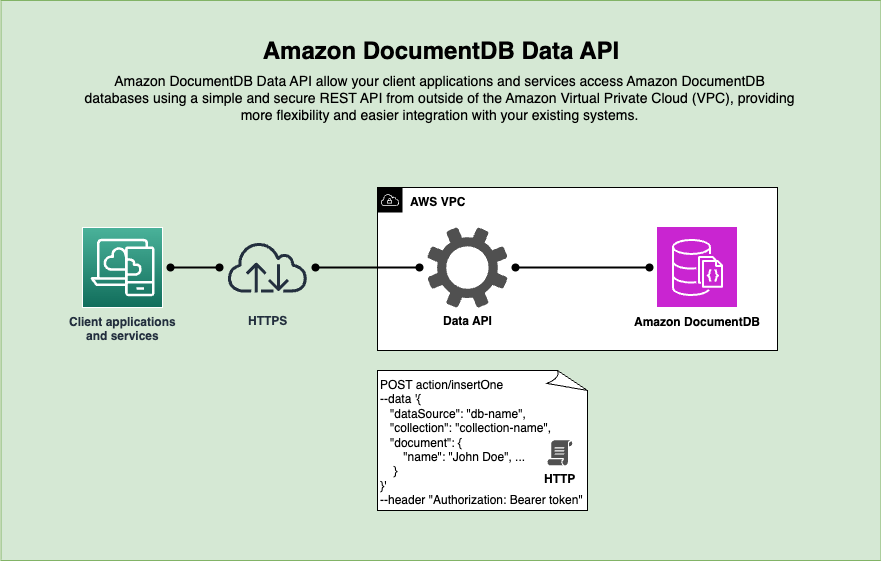

# Amazon DocumentDB Data API

## Description

Amazon DocumentDB Data API allow your client applications and services access Amazon DocumentDB databases using a simple and secure REST API service from outside of the Amazon Virtual Private Cloud (VPC), providing more flexibility and easier integrations with your existing applications. 

## Architecture



## Getting started

Install the pre-requisites nvm, nodejs, npm, nestjs, and yarn

```bash
#  install make 
sudo yum install -y make gcc-c++

# install nvm
curl -o- https://raw.githubusercontent.com/nvm-sh/nvm/v0.40.0/install.sh | bash
export NVM_DIR="$([ -z "${XDG_CONFIG_HOME-}" ] && printf %s "${HOME}/.nvm" || printf %s "${XDG_CONFIG_HOME}/nvm")"
[ -s "$NVM_DIR/nvm.sh" ] && \. "$NVM_DIR/nvm.sh" # This loads nvm

# install nodejs and use latest LTS
nvm install 20
nvm use 20

# update npm to latest version
npm update -g npm
# install nestjs cli and yarn
npm i -g @nestjs/cli yarn
```

## Installation

Download the source code from the repository and install the dependencies

```bash
# clone the repository 
git clone git@github.com:awslabs/amazon-documentdb-tools.git
cd data-api
# install node module dependencies
yarn install
```

You could optionally install the [mongosh client](https://www.mongodb.com/docs/mongodb-shell/install/) to connect to the Amazon DocumentDB cluster

```bash
# install mongo shell with OpenSSL 3.0 libraries:
sudo tee /etc/yum.repos.d/mongodb-org-7.0.repo <<EOF
[mongodb-org-7.0]
name=MongoDB Repository
baseurl=https://repo.mongodb.org/yum/amazon/2023/mongodb-org/7.0/\$basearch/
gpgcheck=1
enabled=1
gpgkey=https://www.mongodb.org/static/pgp/server-7.0.asc
EOF
sudo yum install -y mongodb-mongosh-shared-openssl3
```

## Running the app

```bash
# set the parameter store key in the environment variable
# example: export MONGODB_CONNECTION_STRING_KEY=/apps/data-api/doc-db/connection_string
# or 
# set the connection string directly (not recommended)
export MONGODB_CONNECTION_STRING_KEY=<your-mongodb-connection-string> 

# for development environment with watch mode enabled
# yarn run start:dev

# for production environment
yarn run start:prod
```
