# How to perform a live migration from Couchbase to Amazon DocumentDB (with MongoDB Compatibility)

This document explains how you can perform a live migration from Couchbase to Amazon DocumentDB and walks you through deploying the solution and performing a live migration of the Couchbase `beer-sample` sample bucket to an Amazon DocumentDB cluster.

## Solution overview

The solution uses Amazon Managed Streaming for Apache Kafka (MSK) to perform a full load of existing data and replicate ongoing changes from Couchbase to Amazon DocumentDB. The solution keeps the target Amazon DocumentDB arget cluster in sync with the source Couchbase cluster until the client applications are cutover to the Amazon DocumentDB cluster. It makes use of the following connectors:

- [Couchbase Kafka connector](https://docs.couchbase.com/kafka-connector/current/index.html) to stream documents from Couchbase Server and publish them to a Kafka topic in near-real time.
- [Couchbase Kafka connector](https://www.mongodb.com/docs/kafka-connector/current/) to read data from a Kafka topic and write it to Amazon DocumentDB.

The solution also uses:
- [AWS Cloudformation](https://aws.amazon.com/cloudformation/) to deploy the solution.
- [AWS Identity and Access Management (IAM)](https://aws.amazon.com/iam/) to manage access to the AWS services and resources used in this solution.
- [Amazon CloudWatch](https://aws.amazon.com/cloudwatch/) for logging and monitoring of the migration.
- [Amazon DocumentDB](https://aws.amazon.com/documentdb/) a single instance cluser as the migration target. You can scale out as necessary.
- [Amazon Elastic Compute Cloud (EC2)](https://aws.amazon.com/ec2/) for a bastion host (and associated resources) you can use to manage the Kafka topic.
- [Amazon MSK](https://aws.amazon.com/msk/) to stream data from Couchbase to Amazon DocumentDB.

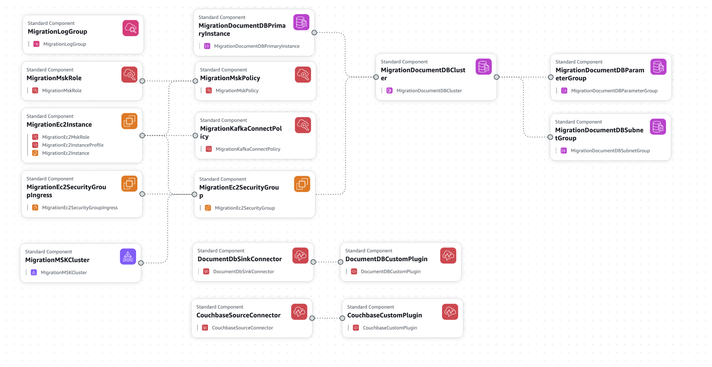

## Pre-requisites

To deploy this solution you will need the following:
1. A Couchbase cluster.
2. An [Amazon Virtual Private Cloud (VPC)](https://aws.amazon.com/vpc/) with
* connectivity to the Couchbase cluster
* 3 private subnets
* 1 public subnet
3. An EC2 key pair to use to connect to the EC2 bastion host.
4. An [Amazon S3](https://aws.amazon.com/pm/serv-s3/) general purpose bucket to store MSK custom plugin and connector resources.


## Step 1 - Deploy IAM, EC2, & Amazon DocumentDB resources and MSK cluster
* Download [couchbase-to-amazon-documentdb.yaml](./couchbase-to-amazon-documentdb.yaml).
* This CloudFormation template creates all required IAM, EC2, and Amazon DocumentDB resources and the MSK cluster. The Amazon DocumentDB cluster is configured to use a custom parameter group with collection-level document compression enabled. The default compression threshold is 2KB. A different value can be specified for new collections using the `createCollection` command, and changed for existing collections using `collMod` command. See [Managing collection-level document compression](https://docs.aws.amazon.com/documentdb/latest/developerguide/doc-compression.html) for more information.

### [CloudFormation console](https://console.aws.amazon.com/cloudformation/home)
* Select **Stacks**.
* Select **Create stack → With new resources (standard)**.
* **Create stack** step:
   * **Specify template** section:
      * Select **Upload a template file**.
      * Select **Choose file** and choose the `couchbase-to-amazon-documentdb.yaml` file downloaded above.
   * Select **Next**.
* **Specify stack details** step:
   * **Provide a stack name** section:
      * **Stack name**: `couchbase-to-documentdb`
   * **Parameters** section
      * **DocumentdbInstanceType**: select desired instance type of DocumentDB cluster primary instance
      * **DocumentdbPassword**: specify password of DocumentDB user
      * **DocumentdbUsername**: specify username of DocumentDB user
      * **Ec2KeyPairName**: specify name of existing EC2 key pair that will be used for the new EC2 instance bastion host
      * **LatestAmiId**: do not change this value
      * **MskBrokerNodes**: specify the number of broker nodes for the MSK cluster that will be created (multiple of the number of private subnets). Refer to [Best practices for Express brokers](https://docs.aws.amazon.com/msk/latest/developerguide/bestpractices-express.html) to determine the number of broker instances.
      * **MskClusterBrokerInstanceType**: select desired instance type of MSK cluster broker
      * **PrivateSubnets**: select 3 private subnets in VPC specified in `VpcId`. The DocumentDB instance and MSK brokers will be created in these subnets.
      * **PublicSubnetId**: select a public in the VPC specified in `VpcId`. An EC2 instance will be created in this subnet for interacting with the Kafka topic used for migration.
      * **S3BucketName**: specify the name of an existing S3 general purpose bucket that will be used to store the custom connector .zip files and trust store .jks file for connecting to the Amazon DocumentDB cluster
      * **SshIngressIpAddress**: specify the IP address (in CIDR notation) to allow SSH traffic to EC2 instance
      * **VpcId**: specify ID of existing VPC where EC2 instance, Amazon DocumentDB cluster, & MSK cluster will be created
   * Select **Next**.
* **Configure stack options** step:
   * **Stack failure options** section:
      * Select **Preserve successfully provisioned resources**.
   * **Capabilities** section:
      * Select the **I acknowledge that AWS CouldFormation might create IAM resources with custom names.** checkbox.
   * Select **Next**.
* **Review and Create** step:
   * **Parameters** section:
      * Ensure all parameters are correct.
   * Select **Submit**.
* It will take ~40 minutes for the stack to fully deploy.
* Select the **Outputs** tab and note the **MigrationMSKRoleARN**, **S3BucketName**, and **SecurityGroupId** values. These will be used as parameters when deploying the next CloudFormation template. 
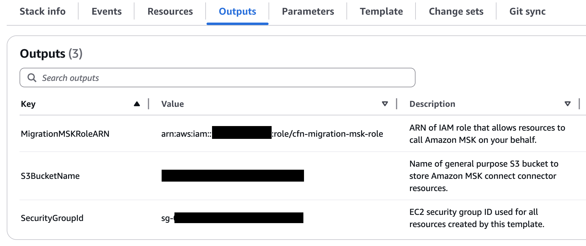
      
## Step 2 - Modify Couchbase security group to allow inbound traffic from `cfn-security-group`.
If you are migrating from self-managed Couchbase on EC2, modify the security group of the EC2 instance(s) to allow inbound traffic from the MSK cluster.

### [EC2 console](https://console.aws.amazon.com/ec2/home)
* Select **Network & Security → Security Groups**.
* Select the security group used for your Couchbase cluster and then select **Inbound rules**.
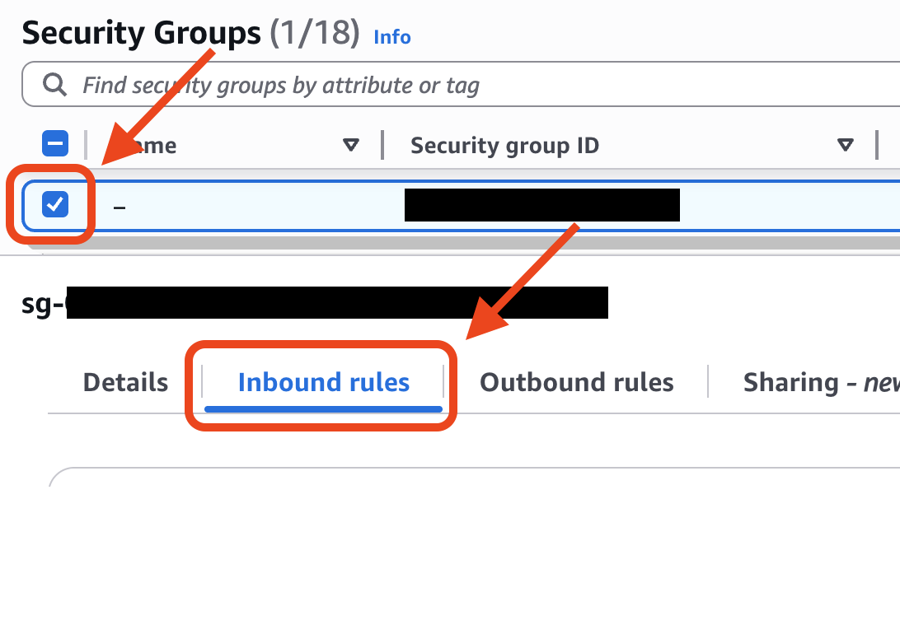

* Select **Edit inbound rules**.
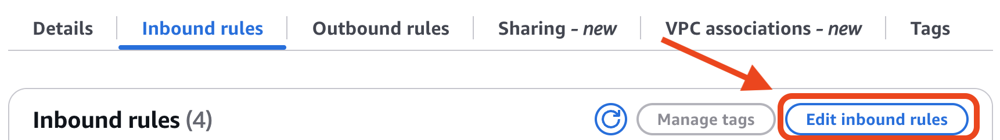

* Select **Add rule** and specify:
   * **Inbound rules** section:
      * **Type**: All traffic
      * **Source**: Custom
      * **Search box**: `cfn-migration-security-group`
   * Select **Save rules**.

## Step 3 - Validate Amazon DocumentDB connectivity and create target collection(s) & indexes.
### [EC2 console](https://console.aws.amazon.com/ec2/home)
* Select **Instances → Instances**.
* Select the **cfn-msk-ec2** instance checkbox and then select **Connect**.
* Copy the example SSH command.
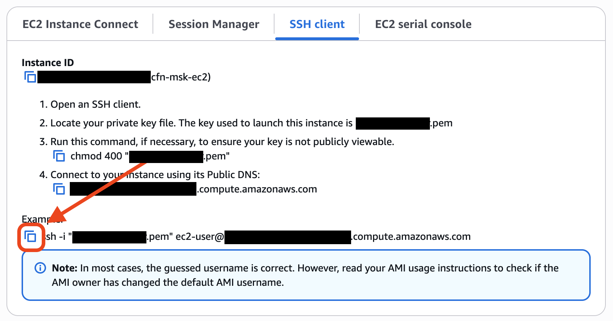
* Go to the server or system represented by the **SshIngressIpAddress** value you specified when deploying `couchbase-to-amazon-documentdb.yaml`.
* Paste and execute the copied command.
* Confirm that you can login to the EC2 instance.
```
   ,     #_
   ~\_  ####_        Amazon Linux 2023
  ~~  \_#####\
  ~~     \###|
  ~~       \#/ ___   https://aws.amazon.com/linux/amazon-linux-2023
   ~~       V~' '->
    ~~~         /
      ~~._.   _/
         _/ _/
       _/m/'
Last login: Mon Jun  9 15:33:18 2025 from XXX.XXX.XXX.XXX
```

### [Amazon DocumentDB console](https://console.aws.amazon.com/docdb/home)
* Select **Clusters**.
* Click the link for the `cfn-documentdb-target` cluster.
* Select the **Connectivity & security** tab.
* **Connect** section:
   * Select **Copy** next to **Connect to this cluster with the mongo shell**.
   * Replace `<insertYourPassword>` with the **DocumentdbPassword** value you specified when deploying `couchbase-to-amazon-documentdb.yaml`.
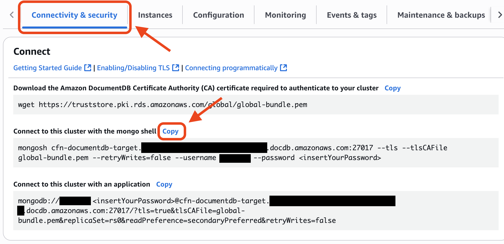

### EC2 bastion host
* Paste and execute the `mongosh` command copied above.
* Confirm that you see the following:
```
rs0 [direct: primary] test>
```

It is a best practice to create indexes before migrating data so create the target collection(s) and indexes.
* Create the required target database(s) and collection(s). These instructions use the `test` collection in the `beer-sample` database with the default 2 KB threshold. See [Setting the compression thresholds](https://docs.aws.amazon.com/documentdb/latest/developerguide/doc-compression.html#manage-compression) to create a collection with a different compression threshold.
```
rs0 [direct: primary] test> use beer-sample
switched to beer-sample
rs0 [direct: primary] beer-sample> db.createCollection("test")
{ ok: 1 }
rs0 [direct: primary] beer-sample> show collections
test
```
* Create the required indexes on the target collection(s). For example, create an index on the `type` field in the `test` collection:
```
rs0 [direct: primary] beer-sample> db.test.createIndex({"type": 1})
type_1
```
* View the indexes that exist on the `test` collection. All collections in Amazon DocumentDB have a default index on the `_id` field so in this example there will be two indexes. 
```
rs0 [direct: primary] beer-sample> db.test.getIndexes()
[
  { v: 4, key: { _id: 1 }, name: '_id_', ns: 'beer-sample.test' },
  { v: 4, key: { type: 1 }, name: 'type_1', ns: 'beer-sample.test' }
]
```
* Exit mongo shell by typing `exit`.
```
rs0 [direct: primary] beer-sample> exit
```
## Step 4 - Deploy MSK Connect resources.
*This guide assumes you are using the `test` collection in the `beer-sample` database. If you specify a different collection and database, modify the commands accordingly.*
* Download [couchbase-to-amazon-documentdb-connectors.yaml](./couchbase-to-amazon-documentdb-connectors.yaml).
* Edit `couchbase-to-amazon-documentdb-connectors.yaml`.
   * Provide the values for the following in the `DocumentDbSinkConnector.Properties.ConnectorConfiguration` section:
      * **database** (line 117): target Amazon DocumentDB database name (e.g. `beer-sample`)
      * **collection** (line 118): target Amazon DocumentDB collection name (e.g. `test`)
      * **connection.uri** (line 119): copy the connection string from the Amazon DocumentDB console
         * [Amazon DocumentDB console](https://console.aws.amazon.com/docdb/home)
            * Select **Clusters**.
            * Click the link for the `cfn-documentdb-target` cluster.
            * Select the **Connectivity & security** tab.
            * **Connect** section:
               * Select **Copy** next to **Connect to this cluster with an application**.
               * Replace `<insertYourPassword>` with your password and use this as the value for **connection.uri**.
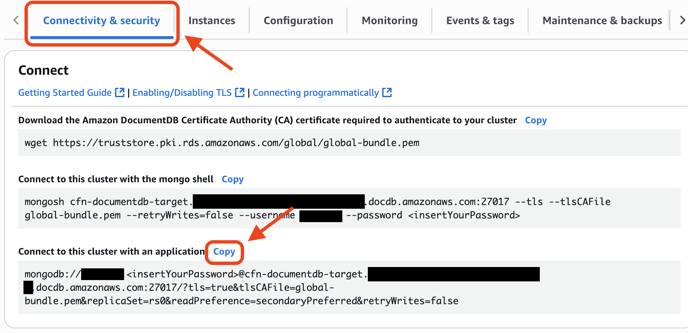

   * Provide the values for the following in the `CouchbaseSourceSinkConnector.Properties.ConnectorConfiguration` section:
      * **couchbase.seed.nodes** (line 175): Couchbase source seed nodes
      * **couchbase.bucket** (line 176): source Couchbase bucket
      * **couchbase.username** (line 177): Couchbase user username
      * **couchbase.password** (line 178): Couchbase user password

### [CloudFormation console](https://console.aws.amazon.com/cloudformation/home)
* Select **Stacks**.
* Select **Create stack → With new resources (standard)**.
* **Create stack** step:
   * **Specify template** section:
      * Select **Upload a template file**.
      * Select **Choose file** and choose the `couchbase-to-amazon-documentdb-connectors.yaml` file downloaded above.
   * Select **Next**.
* **Specify stack details** step:
   * **Provide a stack name** section:
      * **Stack name**: `couchbase-to-documentdb-connectors`
   * **Parameters** section
      * **BootstrapServers**: copy the private endpoint value from the Amazon MSK console
         * [Amazon MSK console](https://console.aws.amazon.com/msk/home)
            * Select **MSK Clusters → Clusters**.
            * Click the **`cfn-msk-cluster`** link.
            * Select **View client information**.
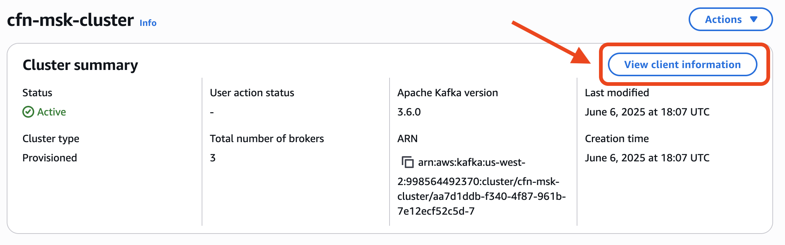
            * Copy the **Private endpoint (single-VPC)** value and use as the value for **BootstrapServers**.
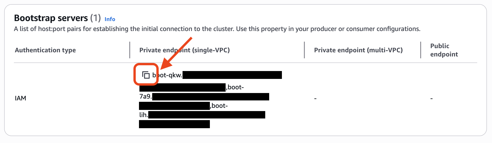
      * **CouchbaseSourceMcuCount**: specify the number of microcontroller units (MCUs) per worker (e.g. 2). Each MCU provides 1 vCPU of compute and 4 GiB of memory. Connectors are scaled by increasing the number of workers and/or the MCU count per worker to adjust for workload changes. 
      * **CouchbaseSourceMcuWorkers**: specify the number of workers (e.g. 1). A worker is a Java virtual machine (JVM) process that executes the logic of a Kafka Connect connector in Amazon MSK Connect.
      * **DocumentDbSinkMcuCount**: specify the number of MCUs per worker (e.g. 2)
      * **DocumentDbSinkMcuWorkers**: specify the number of workers (e.g. 2). For Amazon DocumentDB, more workers provide more parallelism and higher update rates.
      * **MigrationMSKRoleARN**: use the value of the **MigrationMSKRoleARN** key from the `couchbase-to-amazon-documentdb.yaml` **Outputs** tab
      * **PrivateSubnets**: select 3 private subnets in VPC specified in VpcId. These must be the same 3 private subnets used when deploying couchbase-to-amazon-documentdb.yaml.
      * **S3BucketName**: use the value of this Key from the `couchbase-to-amazon-documentdb.yaml` **Outputs** tab.
      * **SecurityGroupId**: use the value of this Key from the `couchbase-to-amazon-documentdb.yaml` **Outputs** tab.
   * Select **Next**.
* **Configure stack options** step:
   * **Stack failure options** section:
      * Select **Preserve successfully provisioned resources**.
   * Select **Next**.
* **Review and Create** step:
   * **Parameters** section:
      * Ensure all parameters are correct.
   * Select **Submit**.
* It will take ~15 minutes for the stack to fully deploy.

## Step 5 - Create Kafka topic to use for live migration.
*Note that the migration will start immediately after creating the Kafka topic. When you deployed `couchbase-to-amazon-documentdb-connectors.yaml`, the Couchbase source and Amazon DocumentDB sink connectors were created and they will start writing to and reading from the **couchbase-to-documentdb** topic when it exists.*

[Amazon MSK console](https://console.aws.amazon.com/msk/home)
* Select **MSK Clusters → Clusters**.
* Click the **`cfn-msk-cluster`** link.
* Select **View client information**. 

* Copy the **Private endpoint (single-VPC)** value.


### EC2 bastion host
* Execute the following command to create a `BOOTSTRAP_SERVER` environment variable based on the **Private endpoint (single-VPC)** value you copied above.
```
echo 'export BOOTSTRAP_SERVER="<private-endpoint-single-vpc>"' >> ~/.bashrc
```
* Execute the `~/.bashrc` file to set the environment variable.
```
source ~/.bashrc
```
* Create the `couchbase-to-documentdb` topic that will be used for the migration. **At this point the migration will begin.**
```
kafka_2.13-4.0.0/bin/kafka-topics.sh \
--create \
--bootstrap-server $BOOTSTRAP_SERVER \
--command-config kafka_2.13-4.0.0/config/client.properties \
--replication-factor 3 \
--partitions 15 \
--topic couchbase-to-documentdb
```
* You will see the following message if successful.
```
created topic couchbase-to-documentdb.
```
* List all topics in the cluster.
```
kafka_2.13-4.0.0/bin/kafka-topics.sh \
--list \
--bootstrap-server $BOOTSTRAP_SERVER \
--command-config kafka_2.13-4.0.0/config/client.properties
```
* You will see the `couchbase-to-documentdb` topic and additional topics created by Amazon MSK.
```
__amazon_msk_canary
__amazon_msk_connect_configs_cfn-couchbase-source-*
__amazon_msk_connect_configs_cfn-documentdb-sink-*
__consumer_offsets
couchbase-to-documentdb
```
* Finally, describe the `couchbase-to-documentdb` topic.
```
kafka_2.13-4.0.0/bin/kafka-topics.sh \
--describe \
--bootstrap-server $BOOTSTRAP_SERVER \
--command-config kafka_2.13-4.0.0/config/client.properties \
--topic couchbase-to-documentdb
```
* Confirm that it has the specified number of partitions (15).
```
Topic: couchbase-to-documentdb  TopicId: 4GwdAvIvQm-OF2ZlZtMTeg PartitionCount: 15  ReplicationFactor: 3  Configs: message.format.version=3.0-IV1,min.insync.replicas=2,unclean.leader.election.enable=false,message.timestamp.after.max.ms=86400000,message.timestamp.before.max.ms=86400000,message.timestamp.difference.max.ms=86400000
  Topic: couchbase-to-documentdb  Partition: 0  Leader: 2 Replicas: 2,3,1 Isr: 2,3,1  Elr: N/A  LastKnownElr: N/A
  Topic: couchbase-to-documentdb  Partition: 1  Leader: 1 Replicas: 1,2,3 Isr: 1,2,3  Elr: N/A  LastKnownElr: N/A
  Topic: couchbase-to-documentdb  Partition: 2  Leader: 3 Replicas: 3,1,2 Isr: 3,1,2  Elr: N/A  LastKnownElr: N/A
  Topic: couchbase-to-documentdb  Partition: 3  Leader: 2 Replicas: 2,1,3 Isr: 2,1,3  Elr: N/A  LastKnownElr: N/A
  Topic: couchbase-to-documentdb  Partition: 4  Leader: 1 Replicas: 1,3,2 Isr: 1,3,2  Elr: N/A  LastKnownElr: N/A
  Topic: couchbase-to-documentdb  Partition: 5  Leader: 3 Replicas: 3,2,1 Isr: 3,2,1  Elr: N/A  LastKnownElr: N/A
  Topic: couchbase-to-documentdb  Partition: 6  Leader: 2 Replicas: 2,3,1 Isr: 2,3,1  Elr: N/A  LastKnownElr: N/A
  Topic: couchbase-to-documentdb  Partition: 7  Leader: 1 Replicas: 1,2,3 Isr: 1,2,3  Elr: N/A  LastKnownElr: N/A
  Topic: couchbase-to-documentdb  Partition: 8  Leader: 3 Replicas: 3,1,2 Isr: 3,1,2  Elr: N/A  LastKnownElr: N/A
  Topic: couchbase-to-documentdb  Partition: 9  Leader: 2 Replicas: 2,1,3 Isr: 2,1,3  Elr: N/A  LastKnownElr: N/A
  Topic: couchbase-to-documentdb  Partition: 10 Leader: 1 Replicas: 1,3,2 Isr: 1,3,2  Elr: N/A  LastKnownElr: N/A
  Topic: couchbase-to-documentdb  Partition: 11 Leader: 3 Replicas: 3,2,1 Isr: 3,2,1  Elr: N/A  LastKnownElr: N/A
  Topic: couchbase-to-documentdb  Partition: 12 Leader: 2 Replicas: 2,3,1 Isr: 2,3,1  Elr: N/A  LastKnownElr: N/A
  Topic: couchbase-to-documentdb  Partition: 13 Leader: 1 Replicas: 1,2,3 Isr: 1,2,3  Elr: N/A  LastKnownElr: N/A
  Topic: couchbase
```
* Confirm that the documents from the `beer-sample` Couchbase bucket exist in the `beer-sample.test` collection in the Amazon DocumentDB cluster. Use the `mongosh` command you used earlier when validating the connection to the cluster from the EC2 instance.
```
rs0 [direct: primary] test> use beer-sample
switched to db beer-sample
rs0 [direct: primary] beer-sample> db.test.countDocuments()
7303
```
* Find a specific document:
```
rs0 [direct: primary] beer-sample> db.test.find({"_id":"21st_amendment_brewery_cafe"})
[
  {
    _id: '21st_amendment_brewery_cafe',
    geo: { accuracy: 'ROOFTOP', lon: -122.393, lat: 37.7825 },
    country: 'United States',
    website: 'http://www.21st-amendment.com/',
    code: '94107',
    address: [ '563 Second Street' ],
    city: 'San Francisco',
    phone: '1-415-369-0900',
    name: '21st Amendment Brewery Cafe',
    description: 'The 21st Amendment Brewery offers a variety of award winning house made brews and American grilled cuisine in a comfortable loft like setting. Join us before and after Giants baseball games in our outdoor beer garden. A great location for functions and parties in our semi-private Brewers Loft. See you soon at the 21A!',
    state: 'California',
    type: 'brewery',
    updated: '2010-10-24 13:54:07'
  }
]
rs0 [direct: primary] beer-sample> db.test.find({"_id":"21st_amendment_brewery_cafe"})
```
* Get distinct `type` values:
```
rs0 [direct: primary] beer-sample> db.test.distinct("type")
[ 'beer', 'brewery' ]
```
* Get count of `brewery` documents:
```
rs0 [direct: primary] beer-sample> db.test.find({"type":"brewery"}).count()
1412
```
## Cleanup
[Amazon S3 console](https://console.aws.amazon.com/s3/home)
* Select **Amazon S3 → General purpose buckets**.
* Click the link for the S3 Bucket specified when deploying the CloudFormation templates.
* Select the **Objects** tab.
* **Objects** section:
   * Select the following objects:
      * `couchbase-kafka-connect-couchbase-4.2.8.zip`
      * `docdb-custom-plugin.zip`
      * `docdb-truststore.jks`
* Select **Delete**.
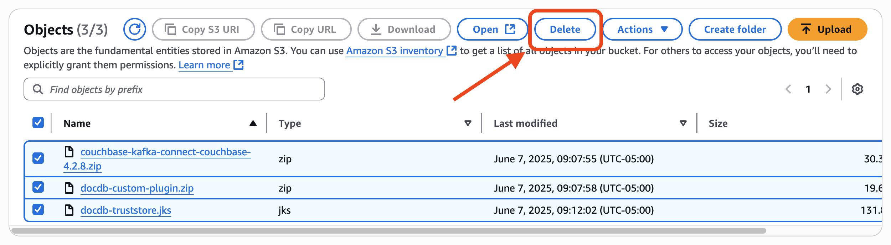
* **Specified objects** section:
   * Confirm the following 3 objects are listed.
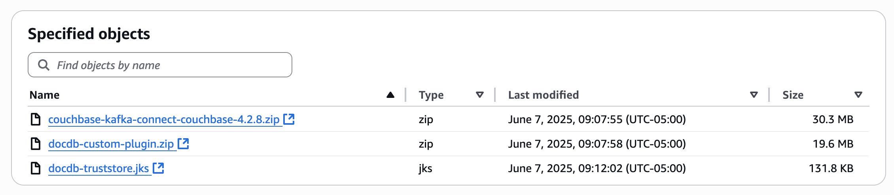
* **Permanently delete objects?** section:
   * Type **permanently delete**.
   * Select **Delete objects**.

### [EC2 console](https://console.aws.amazon.com/ec2/home)
* Select **Network & Security → Security Groups**.
* Find the **cfn-migration-security-group** security group and note the Security group ID.
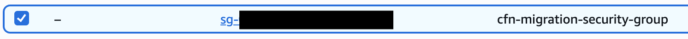
* Select the security group used for your Couchbase cluster and then select **Inbound rules**.

* Select **Edit inbound rules**.

* Find the **Inbound rule** that has a **Source matching** the **cfn-migration-security-group** id and select **Delete**.
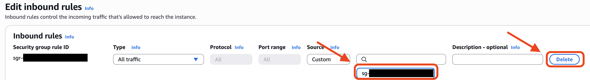
* Select **Save rules**.

### [CloudFormation console](https://console.aws.amazon.com/cloudformation/home)
* Select **CloudFormation → Stacks**.
* Select the **couchbase-to-documentdb-connectors** stack.
* Select **Delete**.
* **Delete stack?** popup:
   * Select **Delete**.
* It will take ~1 minute for the stack to fully delete
* Select **CloudFormation → Stacks**.
* Select the **couchbase-to-documentdb** stack.
* Select **Delete**.
* **Delete stack?** popup:
   * Select **Delete**.
* It will take ~15 minutes for the stack to fully delete.

## Other useful Kafka commands.
### Publish messages to a topic
```
kafka_2.13-4.0.0/bin/kafka-console-producer.sh \
--bootstrap-server $BOOTSTRAP_SERVER \
--producer.config kafka_2.13-4.0.0/config/client.properties \
--topic couchbase-to-documentdb \
--property "parse.key=true" \
--property "key.separator=:"
> msg1:{"msg": "this is a test"}
> msg2:{"src": "kafka-console-producer"}
```
Press `ctrl-d` to exit.
### Consume messages from a topic
```
kafka_2.13-4.0.0/bin/kafka-console-consumer.sh \
--bootstrap-server $BOOTSTRAP_SERVER \
--consumer.config kafka_2.13-4.0.0/config/client.properties \
--topic couchbase-to-documentdb \
--property print.key=true \
--from-beginning
```
Press `ctrl-c` to exit.
### Delete a topic.
```
kafka_2.13-4.0.0/bin/kafka-topics.sh \
--delete \
--bootstrap-server $BOOTSTRAP_SERVER \
--command-config kafka_2.13-4.0.0/config/client.properties \
--topic couchbase-to-documentdb
```
